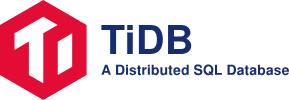

- **Twitter**: [@Ekjotmakhija](https://twitter.com/Ekjotmakhija)

## What is TiDB?

TiDB ("Ti" stands for Titanium) is an open-source NewSQL database that supports Hybrid Transactional and Analytical Processing (HTAP) workloads. It is MySQL compatible and features horizontal scalability, strong consistency, and high availability.

- __Horizontal Scalability__

    TiDB expands both SQL processing and storage by simply adding new nodes. This makes infrastructure capacity planning both easier and more cost-effective than traditional relational databases which only scale vertically.

- __MySQL Compatible Syntax__

    TiDB acts like it is a MySQL 5.7 server to your applications. You can continue to use all of the existing MySQL client libraries, and in many cases, you will not need to change a single line of code in your application. Because TiDB is built from scratch, not a MySQL fork, please check out the list of [known compatibility differences](#).

- __Distributed Transactions with Strong Consistency__

    TiDB internally shards table into small range-based chunks that we refer to as "regions". Each region defaults to approximately 100MiB in size, and TiDB uses a Two-phase commit internally to ensure that regions are maintained in a transactionally consistent way.

- __Cloud Native__

    TiDB is designed to work in the cloud -- public, private, or hybrid -- making deployment, provisioning, operations, and maintenance simple.

- __Minimize ETL__

    TiDB is designed to support both transaction processing (OLTP) and analytical processing (OLAP) workloads. This means that while you may have traditionally transacted on MySQL and then Extracted, Transformed and Loaded (ETL) data into a column store for analytical processing, this step is no longer required.

- __High Availability__

    TiDB uses the Raft consensus algorithm to ensure that data is highly available and safely replicated throughout storage in Raft groups. In the event of failure, a Raft group will automatically elect a new leader for the failed member, and self-heal the TiDB cluster without any required manual intervention. Failure and self-healing operations are also transparent to applications.

## Architecture

## Contributing
Contributions are welcomed and greatly appreciated. See [CONTRIBUTING.md](CONTRIBUTING.md)
for details on submitting patches and the contribution workflow.

## License
TiDB is under the Apache 2.0 license. See the [LICENSE](./LICENSE) file for details.

